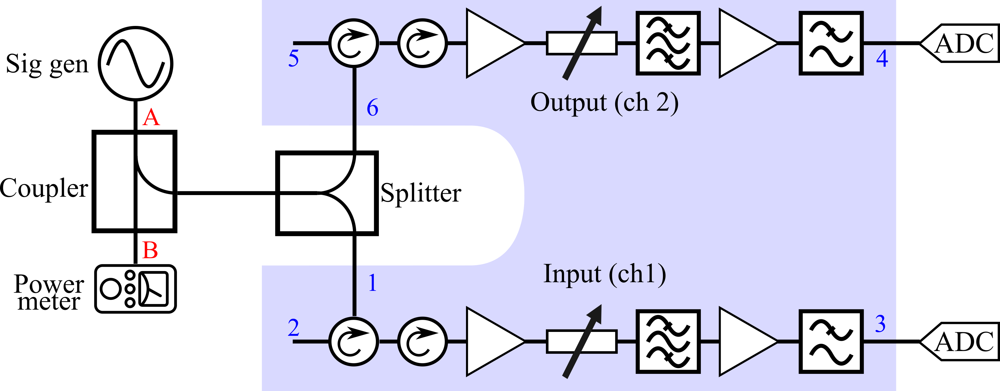
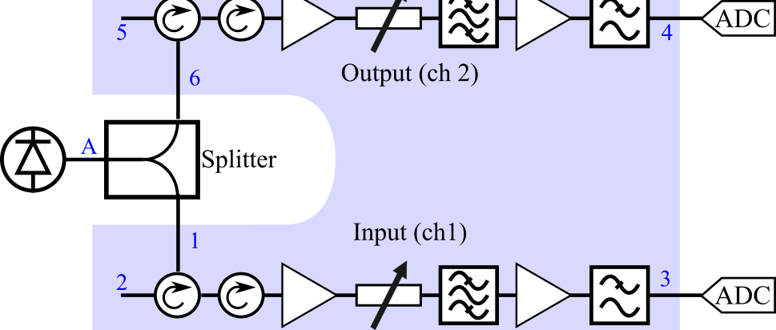
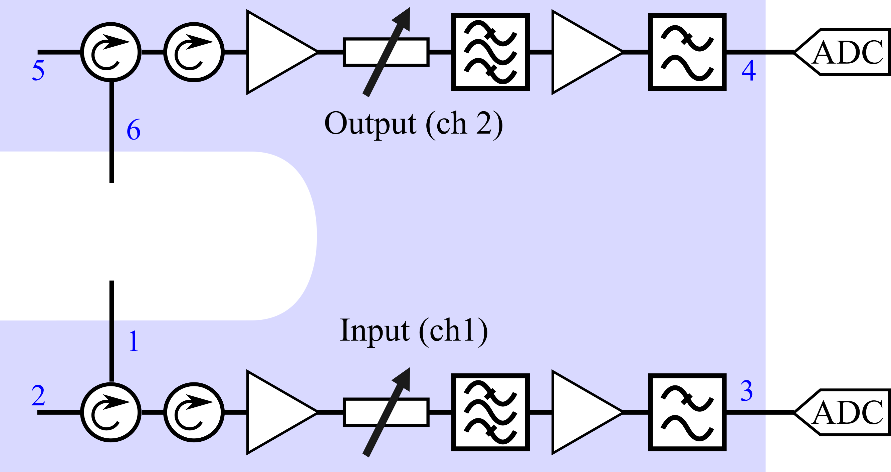
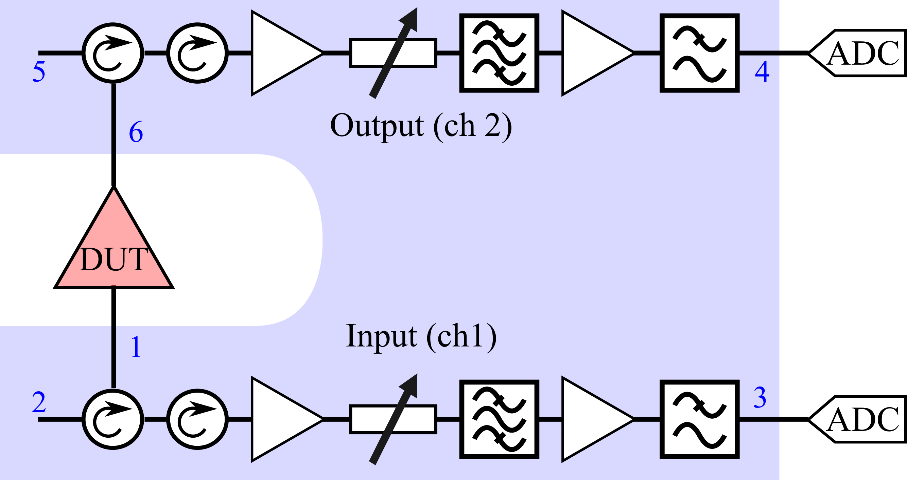

# Mathematical Processing Overview

## CW (Continuous Wave) Processing

The CW processing module analyzes known continuous wave signals to determine complex channel gains and phase relationships. The mathematical process follows these key steps:

### 1. ADC Voltage Conversion and FFT Analysis

Raw ADC counts are converted to voltage and transformed to the frequency domain:

$$V_{ch}(t) = \text{ADC}_{ch} \times V_{\text{tick}}$$

$$\mathcal{F}_{ch}(f) = \text{FFT}(V_{ch}(t))$$

where $V_{\text{tick}}$ is the voltage per ADC tick and $\mathcal{F}_{ch}(f)$ represents the complex FFT spectrum for each channel.

### 2. S-Parameter Calculation

The incident wave amplitude is calculated from the known input power:

$$a_{\text{in}} = \sqrt{P_{\text{in}}} = \sqrt{10^{(P_{\text{dBm}} - 30)/10}}$$

The outgoing wave amplitudes are derived from the FFT peak values:

$$b_{\text{out}} = \frac{V_{\text{rms}}}{\sqrt{Z_0}} = \frac{|\mathcal{F}(f_{\text{target}})| \cdot 2}{N \cdot \sqrt{2} \cdot \sqrt{Z_0}}$$

Raw S-parameters are computed as the ratio of outgoing to incident waves:

$$S_{31,\text{raw}} = \frac{b_{\text{out,ch1}}}{a_{\text{in}}}, \quad S_{46,\text{raw}} = \frac{b_{\text{out,ch2}}}{a_{\text{in}}}$$

### 3. Alpha-Beta Correction

To account for systematic errors in the measurement setup, alpha and beta correction factors are applied using S-parameter characterization data. From the calibration network analysis:

$$\alpha = \frac{S_{1A}^{SP}(1 - S_{BB}^{SP}\Gamma^{PM})}{S_{BA}^{SP}(1 - S_{11}^{SP}\Gamma^{NCin})}$$

$$\beta = \frac{S_{6A}^{SP}(1 - S_{BB}^{SP}\Gamma^{PM})}{S_{BA}^{SP}(1 - S_{66}^{SP}\Gamma^{NCout})}$$

where:

- $S_{ij}^{SP}$ are S-parameters of the signal path components
- $\Gamma^{PM}$ is the power meter sensor reflection coefficient  
- $\Gamma^{NCin}, \Gamma^{NCout}$ are noise correlator input/output reflection coefficients

### 4. Mismatch Correction and Final Results

A mismatch correction factor accounts for impedance discontinuities:

$$M = \sqrt{1 - |\Gamma^{PM}|^2}$$

The corrected S-parameters are:

$$S_{31,\text{corrected}} = \frac{S_{31,\text{raw}}}{\alpha} \cdot M$$

$$S_{46,\text{corrected}} = \frac{S_{46,\text{raw}}}{\beta} \cdot M$$

### 5. Gain Magnitude and Phase Extraction

Finally, the gain magnitudes and phase difference are extracted:

$$|S_{31,\text{corrected}}|_{\text{dB}} = 20\log_{10}|S_{31,\text{corrected}}| \text{ (dB)}$$

$$|S_{46,\text{corrected}}|_{\text{dB}} = 20\log_{10}|S_{46,\text{corrected}}| \text{ (dB)}$$

$$\Delta\phi = \arg(S_{31,\text{corrected}} \cdot S_{46,\text{corrected}}^*)$$

The result is a frequency-dependent characterization of both channels' complex transfer functions, enabling precise gain and phase corrections for subsequent noise measurements.

**Outputs**: The primary outputs for use in subsequent processing stages are the complex-valued corrected S-parameters $S_{31}$ and $S_{46}$, which contain both magnitude and phase information for each channel across the measurement frequency range (1-2 GHz).

## Noise Diode (ND) Processing  

The ND processing module uses calibrated noise sources to determine power-based channel gains and phase relationships. This approach provides an alternative gain calibration method that complements the CW measurements. The mathematical process follows these key steps:

### 1. ADC Voltage Conversion and PSD Analysis

Similar to CW processing, raw ADC counts are converted to voltage:

$$V_{ch}(t) = \text{ADC}_{ch} \times V_{\text{tick}}$$

However, instead of FFT analysis at specific frequencies, the ND processing calculates power spectral densities (PSD) and cross-spectral density (CSD) across the entire frequency range:

$$\text{PSD}_{ch}(f) = \left\langle|\mathcal{F}_{ch}(f)|^2\right\rangle \quad \text{(V²/Hz)}$$

$$\text{CSD}_{12}(f) = \left\langle\mathcal{F}_{ch1}(f) \cdot \mathcal{F}_{ch2}^*(f)\right\rangle \quad \text{(V²/Hz)}$$

where $\langle \cdot \rangle$ denotes averaging over multiple noise traces.

### 2. Noise Diode Calibration

The noise diode provides a known noise temperature reference. The calibration data is converted to power spectral density:

$$\text{PSD}_{\text{ref}}(f) = T_{\text{noise}}(f) \times k_B \quad \text{(W/Hz)}$$

where $T_{\text{noise}}(f)$ is the frequency-dependent noise temperature from calibration data and $k_B$ is Boltzmann's constant.

### 3. Power Gain Calculation

Power-based gains are calculated by normalizing the measured PSDs to the reference noise diode PSD:

$$|S_{31,\text{power}}|^2(f) = \frac{\text{PSD}_{ch1}(f)/R_0}{\text{PSD}_{\text{ref}}(f)}$$

$$|S_{46,\text{power}}|^2(f) = \frac{\text{PSD}_{ch2}(f)/R_0}{\text{PSD}_{\text{ref}}(f)}$$

The cross-spectral density provides phase information:

$$S_{\text{cross}}(f) = \frac{\text{CSD}_{12}(f)/R_0}{\text{PSD}_{\text{ref}}(f)}$$

### 4. Voltage-Equivalent Gain Conversion

Since power relates to voltage as $|S|^2 = |S_{\text{voltage}}|^2$, the voltage gain magnitudes are:

$$|S_{31,\text{raw}}| = \sqrt{|S_{31,\text{power}}|^2}, \quad |S_{46,\text{raw}}| = \sqrt{|S_{46,\text{power}}|^2}$$

The phase difference between channels is extracted from the cross-spectral density:

$$\Delta\phi(f) = \arg(S_{\text{cross}}(f))$$

### 5. Gain Corrections

Gain corrections are applied using the splitter characterization data to account for path differences:

$$S_{31,\text{corrected}} = \frac{S_{31,\text{raw}}}{S_{1A}}, \quad S_{46,\text{corrected}} = \frac{S_{46,\text{raw}}}{S_{6A}}$$

where $S_{1A}$ and $S_{6A}$ are the complex transmission coefficients from port A to ports 1 and 6 respectively through the splitter.

### 6. Complex Gain Assembly

The final complex gains are assembled by distributing the phase difference between channels:

$$S_{31,\text{complex}} = |S_{31,\text{corrected}}| \times e^{j\Delta\phi/2}$$

$$S_{46,\text{complex}} = |S_{46,\text{corrected}}| \times e^{-j\Delta\phi/2}$$

This convention preserves the relative phase difference while providing symmetric phase distribution.

**Outputs**: The primary outputs are the complex-valued S-parameters $S_{31}$ and $S_{46}$, which provide an alternative power-based calibration for comparison with CW-derived gains, along with the phase difference $\Delta\phi$ between channels.

## Load Calibration

The Load Calibration module characterizes the system's inherent noise properties using 50-ohm terminations. This calibration provides a reference baseline by measuring the noise floor of the measurement system itself, which is essential for accurate noise figure calculations in subsequent DUT analysis. The mathematical process follows these key steps:

### 1. Load Measurement and PSD Analysis

Similar to ND processing, raw ADC counts from the 50-ohm load measurements are converted to voltage:

$$V_{ch}(t) = \text{ADC}_{ch} \times V_{\text{tick}}$$

Power spectral densities (PSD) and cross-spectral density (CSD) are calculated across the frequency range:

$$b^{\text{load}}_3(f) = \left\langle|\mathcal{F}_{ch1}(f)|^2\right\rangle \quad \text{(V²/Hz)}$$

$$b^{\text{load}}_4(f) = \left\langle|\mathcal{F}_{ch2}(f)|^2\right\rangle \quad \text{(V²/Hz)}$$

$$\text{CSD}_{34}(f) = \left\langle\mathcal{F}_{ch1}(f) \cdot \mathcal{F}_{ch2}^*(f)\right\rangle \quad \text{(V²/Hz)}$$

where $\langle \cdot \rangle$ denotes averaging over multiple noise traces from the 50-ohm loads.

### 2. Gain Correction Application

The measured PSDs contain both the thermal noise from the 50-ohm loads and the system's transfer function. To isolate the system noise characteristics, gain corrections from both CW and ND calibrations are applied in parallel:

**CW-Based Correction:**
$$b^{\text{load}}_{3,\text{corrected}} = b^{\text{load}}_3 - |S_{31,\text{CW}}|^2_{\text{dB}}$$

$$b^{\text{load}}_{4,\text{corrected}} = b^{\text{load}}_4 - |S_{46,\text{CW}}|^2_{\text{dB}}$$

**ND-Based Correction:**
$$b^{\text{load}}_{3,\text{corrected}} = b^{\text{load}}_3 - |S_{31,\text{ND}}|^2_{\text{dB}}$$

$$b^{\text{load}}_{4,\text{corrected}} = b^{\text{load}}_4 - |S_{46,\text{ND}}|^2_{\text{dB}}$$

where the gains are converted to power (dB) units for subtraction from the measured PSDs.

### 3. Phase Difference Correction

The phase relationships are similarly corrected using both calibration methods:

$$\Delta\phi_{\text{load,CW}} = \Delta\phi_{\text{measured}} - \Delta\phi_{\text{CW}}$$

$$\Delta\phi_{\text{load,ND}} = \Delta\phi_{\text{measured}} - \Delta\phi_{\text{ND}}$$

where $\Delta\phi_{\text{measured}} = \arg(\text{CSD}_{34})$ is the measured phase difference.

### 4. System Noise Floor Characterization

The gain-corrected PSDs represent the system's noise floor referenced to the input and are used for visualization and analysis within this module. The corrections include:

- **Thermal noise** from the 50-ohm terminations: $\text{PSD}_{\text{thermal}} = k_B T_0$ (where $T_0 = 290$ K)
- **System noise** contributions from amplifiers, correlator, and measurement electronics
- **Residual systematic errors** not captured by the gain calibrations

### 5. Reference Power Spectral Densities

The load calibration provides both raw and corrected reference data:

**Raw Data (for DUT processing):**
$$b^{\text{load}}_{3,\text{raw}} = b^{\text{load}}_3$$

$$b^{\text{load}}_{4,\text{raw}} = b^{\text{load}}_4$$

**Corrected Data (for visualization):**
$$b^{\text{load}}_{3,\text{corrected}} = b^{\text{load}}_3 - |S_{31}|^2_{\text{dB}}$$

$$b^{\text{load}}_{4,\text{corrected}} = b^{\text{load}}_4 - |S_{46}|^2_{\text{dB}}$$

$$\Delta\phi_{\text{corrected}} = \Delta\phi_{\text{measured}} - \Delta\phi_{\text{gain}}$$

**Outputs**: The primary outputs for DUT processing are the raw power spectral densities $b^{\text{load}}_{3,\text{raw}}$ and $b^{\text{load}}_{4,\text{raw}}$ along with the raw phase difference $\Delta\phi_{\text{measured}}$, which serve as the system noise baseline. The gain-corrected versions are generated in parallel for visualization and analysis purposes within this module.

## DUT (Device Under Test) Analysis

The DUT analysis module performs comprehensive noise parameter extraction by combining all previous calibrations to characterize the noise properties of the device under test. This is the most complex processing stage, involving X-parameter calculations, noise parameter derivation, and final noise figure determination. The mathematical process follows these key steps:

### 1. Data Integration and Parameter Loading

The DUT processing begins by loading measured PSD data from the device under test along with all calibration parameters:

$$b_3^{\text{DUT}}(f), \quad b_4^{\text{DUT}}(f), \quad b_{3,4}^{\text{DUT}}(f)$$

where $b_3^{\text{DUT}}$ and $b_4^{\text{DUT}}$ are the power spectral densities from channels 1 and 2, and $b_{3,4}^{\text{DUT}}$ is the cross power spectral density. The system also loads:

- DUT S-parameters: $S_{11}^{\text{DUT}}, S_{21}^{\text{DUT}}, S_{22}^{\text{DUT}}$
- Correlator reflection coefficients: $S_{11}, S_{66}$
- Channel gains from CW/ND calibration: $S_{31}, S_{46}$
- Load calibration reference: $b_3^{\text{load}}, b_4^{\text{load}}$

### 2. X-Parameter Calculation

The X-parameters represent the fundamental noise characteristics of the DUT. Three critical X-parameters are calculated:

**Channel 1 Noise Power: $\langle|x_{n1}|^2\rangle$**

$$\langle|x_{n1}|^2\rangle = \frac{|1 - S_{11}^{\text{DUT}} S_{11}|^2}{|S_{31}|^2} (|b_3^{\text{DUT}}| - |b_3^{\text{load}}|) + (|1 - S_{11}^{\text{DUT}} S_{11}|^2 - |S_{11}^{\text{DUT}}|^2) k_B T_{\text{amb}}$$

**Channel 2 Noise Power: $\langle|x_{n2}|^2\rangle$**

$$\langle|x_{n2}|^2\rangle = \frac{|1 - S_{22}^{\text{DUT}} S_{66}|^2}{|S_{46}|^2} (|b_4^{\text{DUT}}| - |b_4^{\text{load}}|) + \left(|1 - S_{22}^{\text{DUT}} S_{66}|^2 - |S_{22}^{\text{DUT}}|^2 - \frac{|S_{21}^{\text{DUT}}|^2}{|1 - S_{11}^{\text{DUT}} S_{11}|^2}\right) k_B T_{\text{amb}}$$

**Cross Noise Term: $\langle x_{n1} x_{n2}^*\rangle$**

$$\langle x_{n1} x_{n2}^*\rangle = \frac{(1 - S_{11}^{\text{DUT}} S_{11})(1 - S_{22}^{\text{DUT}*} S_{66}^*)}{S_{31} S_{46}^*} b_{3,4}^{\text{DUT}} - \frac{S_{11}^{\text{DUT}} S_{21}^{\text{DUT}*}}{1 - S_{11}^{\text{DUT}*} S_{11}^*} k_B T_{\text{amb}}$$

These X-parameters contain both the device noise characteristics and the measurement system corrections.

### 3. Noise Parameter Conversion

The X-parameters are converted to normalized noise parameters in Kelvin:

$$x_1 = \frac{\langle|x_{n1}|^2\rangle}{k_B}, \quad x_2 = \frac{\langle|x_{n2}|^2\rangle}{|S_{21}^{\text{DUT}}|^2 k_B}, \quad x_{12} = \frac{\langle x_{n1} x_{n2}^*\rangle}{S_{21}^{\text{DUT}*} k_B}$$

### 4. Four Noise Parameters Extraction

From the normalized X-parameters, the four standard noise parameters are calculated:

**Noise Temperature: $t$**

$$t = x_1 + |1 + S_{11}^{\text{DUT}}|^2 x_2 - 2\,\text{Re}[(1 + S_{11}^{\text{DUT}})^* x_{12}]$$

**Noise Correlation Coefficient: $\eta$**

$$\eta = \frac{x_2(1 + |S_{11}^{\text{DUT}}|^2) + x_1 - 2\,\text{Re}[S_{11}^{\text{DUT}*} x_{12}]}{x_2 S_{11}^{\text{DUT}} - x_{12}}$$

**Optimum Reflection Coefficient: $\Gamma_{\text{opt}}$**

$$\Gamma_{\text{opt}} = \frac{\eta}{2}\left(1 - \sqrt{1 - \frac{4}{|\eta|^2}}\right)$$

**Minimum Noise Temperature: $T_{\text{min}}$**

$$T_{\text{min}} = \frac{x_2 - |\Gamma_{\text{opt}}|^2(x_1 + |S_{11}^{\text{DUT}}|^2 x_2 - 2\,\text{Re}[S_{11}^{\text{DUT}*} x_{12}])}{1 + |\Gamma_{\text{opt}}|^2}$$

### 5. Effective Noise Temperature

For a given generator reflection coefficient $\Gamma_G$, the effective noise temperature is:

$$T_e = T_{\text{min}} + t \frac{|\Gamma_{\text{opt}} - \Gamma_G|^2}{|1 + \Gamma_{\text{opt}}|^2(1 - |\Gamma_G|^2)}$$

For a matched generator ($\Gamma_G = 0$), this simplifies to:

$$T_e = T_{\text{min}} + t \frac{|\Gamma_{\text{opt}}|^2}{|1 + \Gamma_{\text{opt}}|^2}$$

### 6. Noise Resistance

The equivalent noise resistance is calculated from the noise temperature:

$$R_n = \frac{t}{4 \times 296.15\,\text{K}} \times R_0$$

where $R_0 = 50\,\Omega$ is the characteristic impedance.

### 7. Noise Figure Calculation

Finally, the noise figure in dB is computed from the effective noise temperature:

$$\text{NF} = 10\log_{10}\left(\frac{T_{\text{amb}} + T_e}{T_{\text{amb}}}\right)$$

where $T_{\text{amb}} = 296.15$ K is the ambient temperature.

### 8. Dual Calibration Comparison

The entire analysis is performed using both CW and ND gain calibrations in parallel, providing:

- **CW-based results**: Using complex gains from continuous wave measurements
- **ND-based results**: Using power-based gains from noise diode measurements  
- **Comparative analysis**: Direct comparison plots showing consistency between methods

**Outputs**: The primary outputs include frequency-dependent noise parameters ($T_{\text{min}}, \Gamma_{\text{opt}}, R_n, T_e$), noise figure (NF), and comprehensive comparison plots between CW and ND calibration methods. All results are saved in CSV format with parallel processing data for both calibration approaches.
