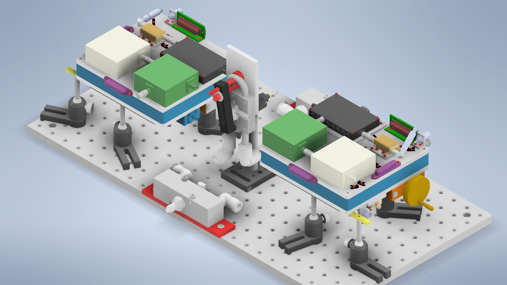

# Correlator Processing

This repository provides tools for processing and analyzing data from the correlator instrument for measurement of low noise amplifiers and transistors. The correlator instrument measures voltage signals from two channels to characterize noise properties and gain parameters of RF devices. This software processes the raw correlator data through several calibration and analysis stages to extract meaningful gain and noise figure measurements. For a detailed overview of the mathematical processing involved, see [MATHEMATICAL_PROCESSING.md](MATHEMATICAL_PROCESSING.md).



## Project Goal

The goal of this software is to provide a complete data processing pipeline for correlator-based noise measurements. The pipeline includes:

1. **Continuous Wave (CW) Processing** - Analyzes known CW signals to determine channel gains and phase relationships
2. **Noise Diode (ND) Processing** - Uses calibrated noise sources for power-based gain measurements  
3. **Load Calibration** - Characterizes system noise using 50-ohm terminations
4. **Device Under Test (DUT) Analysis** - Combines all calibrations to extract noise parameters of test devices

The software outputs processed data, plots, and comprehensive noise parameter analysis including noise figure, minimum noise temperature, and optimal reflection coefficients.

## Environment Setup

### 1. Clone the Repository

```sh
git clone https://github.com/apfox500/Correlator-Processing.git
cd "Correlator Processing"
```

### 2. Set Up Anaconda Environment

The recommended approach is to use the provided `environment.yml` file with Anaconda or Miniconda:

```sh
# Create the environment from the yml file
conda env create -f environment.yml

# Activate the environment
conda activate corr-proc-env
```

This will install all required dependencies including:

- NumPy and SciPy for numerical processing
- Matplotlib and Bokeh for plotting
- Pandas for data handling
- scikit-rf for RF parameter analysis
- tqdm for progress bars

Alternatively, if you prefer pip, you can install packages manually, though conda is recommended for better dependency management.

### 3. Configure Constants

**Before running any processing, you must configure the `Constants.py` file** to match your data setup:

1. **Data Directory**: Set `DATA_DIR` to point to your measurement data location
2. **Dates**: Update the date strings (`CW_DATE`, `ND_DATE`, `LOAD_DATE`, `DUT_DATE`) to match your measurement files
3. **File Formats**: Ensure all filename patterns match your data files (example format shown below):

   - **CW**: `f_CW{freq}GHz_PwrSensorOnCouplerZUDC20-5R23-S+PortB_Split02P1P2OnCorrelatorCh1Ch2_NSamp131072_PWR-30dBm_Att20dB_Ch115dBCh225dB__Fs{FS}GHz_{date}_0.npy` (includes index `_0` and `.npy` extension)
   - **ND**: `NoiseDiode136_AttCh115dBCh225dB_Splitter02_Port0_NSamp2097152_Att0dB__Fs10.0GHz_{date}` (ends at date)
   - **Load**: `LoadCal_AttCh1_15dBCh2_25dB_NSamp2097152__Fs10.0GHz_{date}` (ends at date)
   - **DUT**: `DUT_ZKL2Plus_AttCh1_15dBCh2_25dB_NSamp2097152__Fs10.0GHz_{date}` (ends at date)

4. **File Paths**: Verify all S-parameter and calibration file paths in the `alphabeta/` directory
5. **Output Directory**: Optionally modify `OUT_DIR` for where processed results should be saved

The constants file contains two main sections:

- **User-configurable section** (top) - Change this for each measurement session
- **System constants section** (bottom) - Generally doesn't need changes

## How to Run

There are several ways to run the processing pipeline:

### 1. Standard Method - Run Button

The simplest approach is to use your IDE's run button on `main.py`. With no arguments, this will launch the interactive CLI menu system.

### 2. Interactive CLI

Launch the menu-driven interface:

```sh
python main.py --cli
```

The CLI provides a numbered menu with options:

1. **Process CW** - Analyze continuous wave measurements
2. **Process Noise Diode** - Analyze noise diode calibration data  
3. **Process Load Cal** - Analyze 50-ohm load calibration
4. **Process DUT** - Analyze device under test with full noise parameter extraction
5. **Process All (30 traces)** - Run complete pipeline with 30 data files
6. **Process All (500 traces)** - Run complete pipeline with 500 data files  
7. **Exit**

The CLI guides you through each step and uses defaults from `Constants.py`. Simply press Enter to accept defaults or provide custom values.

### 3. Command Line Flags

You can run individual processing modes directly with command-line arguments:

**Process All Steps:**

```sh
python main.py --all
```

**Individual Processing Modes:**

```sh
# CW Processing
python main.py --cw [--cw-date DATE] [--cw-filename FILENAME] [--cw-graph 0|1|2]

# Noise Diode Processing  
python main.py --nd [--nd-date DATE] [--nd-filename FILENAME] [--nd-num-samples N]

# Load Calibration
python main.py --load [--load-date DATE] [--load-filename FILENAME] [--load-graph]

# DUT Processing
python main.py --dut [--dut-date DATE] [--dut-filename FILENAME] [--dut-num-samples N]
```

**Available Flags:**

- `--cli`: Launch interactive menu
- `--all`: Run complete processing pipeline  
- `--cw`: Run CW processing only
- `--nd`: Run noise diode processing only
- `--load`: Run load calibration only
- `--dut`: Run DUT processing only
- `--cw-graph`: Set CW plotting mode (0=none, 1=basic, 2=detailed)
- `--load-graph`: Show load calibration plots
- Date flags: `--cw-date`, `--nd-date`, `--load-date`, `--dut-date`
- File flags: `--cw-filename`, `--nd-filename`, etc.
- Sample count: `--nd-num-samples`, `--load-num-samples`, `--dut-num-samples`

### 4. Running Individual Files

You can also run the individual processing modules directly:

```sh
python CW.py          # CW processing functions
python ND.py          # Noise diode processing  
python LoadCal.py     # Load calibration
python DUT.py         # DUT analysis
```

However, it is recommended to use the main `main.py` script for a complete workflow, as it handles data flow between modules.

### 5. VS Code Integration

If using VS Code, pre-configured launch configurations may be available in `.vscode/launch.json` for easy debugging and execution.

## Output

All processed data and plots are saved in the `correlator_testing_output/` directory structure:

```text
correlator_testing_output/
├── CW/              # CW processing results
├── NoiseDiode/      # Noise diode results  
├── LoadCal/         # Load calibration results
└── DUT/             # DUT analysis results
```

Each processing run generates:

- **CSV files** with processed data
- **PNG plots** showing frequency responses and analysis
- **Summary text files** documenting the processing parameters and output files

## License and Notice

This software was created in part by an employee of the National Institute of Standards and Technology (NIST), an agency of the U.S. government. Pursuant to title 17 Section 105 of the United States Code, this software is not subject to copyright protection and is in the public domain. See [NOTICE.md](NOTICE.md) for full details.
